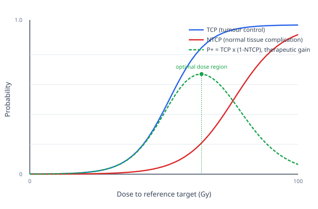

## Synthesis

**Acute vs. late responses.** Acute (early) responses occur within ~3 months, mainly in rapidly renewing "hierarchical" tissues (skin, gut, bone marrow) where stem-cell depletion reduces the supply of differentiated functional cells; they are usually not dose-limiting because of rapid repopulation (raw/Radiation Biology- A Handbook for Teachers and Students.pdf, §2.5.1–2.5.2, §3.11.1). Late responses occur >3 months post-treatment in slowly dividing "flexible" tissues (lung, kidney, liver, CNS) and usually determine the tolerance dose; common late pathology is progressive fibrosis, driven substantially by chronic TGF-β expression stimulating fibroblast-to-fibrocyte differentiation and collagen deposition (§2.5.1, §2.5.3, §3.11.2). Cytokine/chemokine induction (TNF-α, IL-1, TGF-β) occurs within hours of irradiation, can cycle over months, and contributes to damage independent of direct cell killing (§2.5.1, §3.11).

**Organ-specific tolerance (illustrative, from rodent/human data in source).** Skin: erythema >6 Gy single dose, moist desquamation/ulceration 20–25 Gy (§2.5.2). Oral mucosa/oesophagus: mucositis onset ~2–3 weeks into fractionated therapy, spotted-confluent mucositis common at 60–70 Gy/2 Gy fractions (§3.11.1). Lung: pneumonitis at 2–6 months, fibrosis >1 year; tolerance highly volume-dependent, base more sensitive than apex (§3.11.2). Kidney: nephropathy at ~30 Gy/2 Gy fractions to both kidneys, minimal regenerative capacity so tolerance does not increase with prolonged treatment time (§3.11.2). Liver: fatal hepatitis risk above ~30–35 Gy to whole organ; large functional reserve if only part is irradiated (§3.11.2). CNS: reactions from 6 months onward; late effects (necrosis/myelopathy) very sensitive to fraction size; spinal cord repair half-time long (~4 h component), requiring wide spacing of multiple daily fractions (§3.11.2). Heart: pericarditis >1 year post-RT; 45–50 Gy/2 Gy fractions to 50% of heart ≈ 10% complication incidence (§3.11.2).

**Volume effects.** Organs with "parallel" functional architecture (lung, liver, kidney — functional subunits act independently) show tolerance that rises sharply as irradiated volume falls, due to functional reserve. Organs with "serial" architecture (spinal cord — subunits must all function in series) show little change in tolerance dose until the irradiated length falls below a few cm (§3.11.5). IMRT reduces high-dose volume but at the cost of a larger volume receiving low dose, raising unresolved concern about second-malignancy risk (§3.11.5; see [[concept_radiation-carcinogenesis]]).

**Therapeutic ratio.** Defined either as the level of tumour control obtainable at an accepted normal-tissue complication rate (e.g. TD5/5), or as the ratio of doses (Dnormal-tissue/Dtumour) producing equal (e.g. 50%) complication/control probability; tumour-control curves are generally shallower than normal-tissue-complication curves due to tumour heterogeneity (§2.5.5, §3.11.6). See [[concept_tumour-radiobiology]] for the TCP side of this relationship. The concept was first formalized in 1936 by German radiologist Hermann Holthusen, comparing the dose-dependence of tumour control against normal-tissue complications ("raw/Radiobiology Textbook.pdf", Ch.1 §1.4; see [[concept_radiobiology-history]]).

**Quantitative TCP/NTCP modelling.** The qualitative parallel/serial distinction above (see Volume effects) has a quantitative counterpart in the Lyman-Kutcher-Burman (LKB) NTCP model, which reduces a non-uniform dose-volume histogram to an effective volume (v_eff) irradiated at the maximum dose using an exponent n (n≈0 for serial organs such as spinal cord, n≈1 for parallel organs such as lung/liver/kidney), then computes NTCP from a normal-distribution integral parameterized by the tolerance dose TD50(v_eff) and slope m (raw/IsoBED- a tool for automatic calculation of biologically equivalent fractionation schedules in radiotherapy using IMRT with a simultaneous integrated boost (SIB) technique.pdf). Tumour control probability (TCP) is modelled analogously via the Poisson formula TCP = exp(-N*·SF), consistent with the stem-cell-kill model in [[concept_tumour-radiobiology]]. These combine into a single "therapeutic gain" metric, P+ = Π(TCPᵢ) × Π(1-NTCPⱼ), giving a quantitative handle on the therapeutic-ratio concept described above — used in practice to compare candidate treatment plans (e.g. sequential boost vs. simultaneous integrated boost, see [[technique_SIB-IMRT]]).

**Predicting normal-tissue response.** Ataxia telangiectasia and Nijmegen breakage syndrome patients show markedly increased normal-tissue radiosensitivity, supporting a genetic contribution — see [[concept_dna-damage-and-repair]]. In vitro fibroblast/lymphocyte radiosensitivity assays have shown inconsistent predictive power for late fibrosis in the general patient population; cytokine (TGF-β) expression and gene-expression/SNP profiling are active but unvalidated areas (§2.5.4, §3.13.2).

**Retreatment tolerance.** Early-responding tissues largely recover within months, permitting a second high dose; late-responding tissues (especially kidney, heart, bladder) show little recovery of tolerance (§3.11.4).

## History

- 2026-08-03: Page created from ingest of IAEA Training Course Series 42, *Radiation Biology: A Handbook for Teachers and Students* (2010), §2.5, §3.11, §3.13.2.
- 2026-08-03: Added quantitative LKB NTCP / Poisson TCP / therapeutic-gain (P+) formalism from Bruzzaniti et al., *IsoBED* (2011), quantifying the serial/parallel volume-effect distinction already in this page. No contradiction found.
