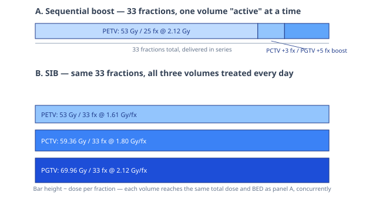

## Synthesis

**What it is.** Simultaneous Integrated Boost (SIB) is an IMRT delivery technique that delivers different dose levels to different target volumes (e.g. a gross tumour volume, clinical target volume, and elective nodal volume) within a single treatment session, using a fixed number of fractions, rather than treating them sequentially with separate courses (raw/IsoBED- a tool for automatic calculation of biologically equivalent fractionation schedules in radiotherapy using IMRT with a simultaneous integrated boost (SIB) technique.pdf). Because all volumes share the same fraction count, each necessarily receives a different dose per fraction — which breaks the usual assumption of a uniform 2 Gy fraction and requires radiobiological (not just physical) equivalence to the conventional sequential-boost prescription it replaces.

**Radiobiological design constraint.** The dose per fraction for each SIB target volume is derived so that its [[concept_fractionation|biologically effective dose (BED)]] matches the BED of the conventional sequential schedule for that volume, using the standard target/OAR-specific α/β ratio. This is the "IsoBED" calculation: given a reference target (which fixes the fraction number for the whole plan), the required dose per fraction for every other target volume is solved from BED₁ = BED₂ (closed-form quadratic root — see [[concept_fractionation]]). Organ-at-risk dose-volume constraints (defined at conventional 2 Gy/fraction) are converted to the new fractionation via the same BED relationship before being used as IMRT optimization constraints.

**Plan evaluation.** SIB plans are commonly compared against the sequential-boost alternative using: dose-volume histograms renormalized to NTD2 (nominal total dose at 2 Gy/fraction, for comparison against literature constraints); tumour control probability (Poisson TCP model) and normal tissue complication probability (Lyman-Kutcher-Burman NTCP model, with the effective-volume method distinguishing serial vs. parallel organ architecture) — see [[concept_normal-tissue-response]] for the underlying models; and a combined therapeutic-gain metric P+ = Π(TCP) × Π(1−NTCP).

**Illustrative use cases (from the source).** Prostate + pelvic lymph nodes (α/β = 1.5 Gy for both targets); head and neck (rhinopharynx) with three nested target volumes (PGTV/PCTV/PETV) receiving 69.96/59.36/53 Gy in a shared 33 fractions instead of a 25+3+5-fraction sequential course; and hypofractionated lung treatment (SIB boost of 50 Gy in 5 fractions vs. a sequential 40 Gy/4 fx + 10 Gy/1 fx course). In each case the SIB schedule was designed to match the sequential plan's BED to the reference target while constraining OAR dose (rectum/bladder/femoral heads/intestine for prostate; spinal cord/brainstem/optic structures/larynx/parotids for head and neck; lung/spinal cord/oesophagus/heart for lung).

**Caveat.** The underlying LQ/BED formalism is generally accepted at conventional fraction sizes but its applicability above ~18–20 Gy per fraction is contested in the literature — relevant if SIB is combined with strongly hypofractionated regimes (see [[concept_fractionation]]).

## History

- 2026-08-03: Page created from ingest of Bruzzaniti et al., "IsoBED: a tool for automatic calculation of biologically equivalent fractionation schedules in radiotherapy using IMRT with a simultaneous integrated boost (SIB) technique," *J. Exp. Clin. Cancer Res.* 30:52 (2011). First page in the Techniques section of this wiki.
